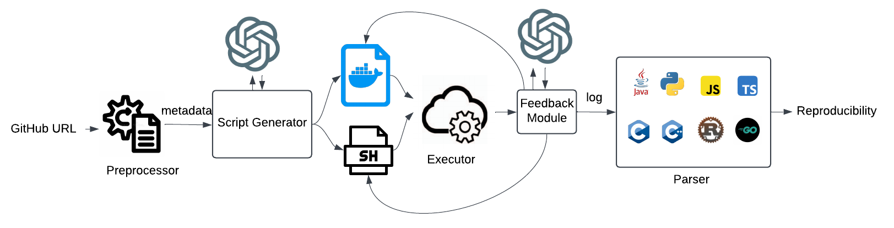

# LLM4Build

## About

LLM4Build is a tool which is used to reproduce a historical GitHub CI build on a 
given GitHub Job URL or GitHub Clone link. It uses LLM to generate the dockerscript
and shellscript which will create an isolated environment and execute test cases 
under the CI Build. Given a GitHub URL as input, LLM4Build generates a
Dockerfile to reconstruct the build environment and a bash script
to execute the build and test processes. It then constructs a Docker
container where the script is executed to compile the repository
and run its tests. Finally, LLM4Build collects the resulting build
log and compares it against the original CI build log to determine
whether the build was successfully reproduced.

<p align="center">  </p>

## Prerequisites

1. Ubuntu-22.04
2. Python >= 3.11
3. Docker (v24.0.7)
4. OpenAI, Together

## Installation & SetUp

1. Clone the repository

```bash
$ git clone https://github.com/rrr8301/LLM4Build.git
```

2. Set up the environment

```bash
$ cd LLM4Build
$ python -m venv <env_name>
$ source <env_name>/bin/activate
```

3. Install the required dependencies

```bash
$ pip install -r requirements.txt
```

4. Set your credentials in `utils/common/credentials.py`:
```bash
GITHUB_TOKENS = ['<your_github_classic_token>']
OPENAI_TOKEN = '<your_openai_token>'
TOGETHER_TOKEN = '<your_openai_token>'
```

## Running one build

LLM4Build supports the following tasks:

1. Historical Build Reproduction — reproduces an existing CI build using its GitHub Actions Job URL.

2. Latest Build Reproduction — reconstructs the most recent build from a repository clone link.

Before running the pipeline:
```bash
$ mkdir project_path
$ mkdir original_logs
$ mkdir intermediates
$ mkdir output
```
Then execute the pipeline

```bash
$ python llm4build-pipeline.py --task <task_type> --link <github_url> --output_folder <folder> --model <LLM_Model>
```

where
```bash
task-type: Either "historical_build" or "latest_build"
github_url: job url or repository link
folder: any folder you want to save the output
model: LLM model, we support three right now - gpt-4o, deepseek-ai/deepseek-V3
```

Lets consider a historical build `https://github.com/PyCQA/flake8/actions/runs/17930213423/job/50985675112`. If we want to execute the pipeline, the command would be:
python llm4build-pipeline.py --task historical_build --output_folder output --model gpt-4o --link
```bash
$ python llm4build-pipeline.py \
    --task historical_build \
    --link https://github.com/PyCQA/flake8/actions/runs/17930213423/job/50985675112 \
    --output_folder output \
    --model gpt-4o
```

The output will be saved inside the `output/gpt-4o/flake8_50985675112/out` folder. The output format will be
```bash
output/<repo>_<job-id>/out/
│
├── Dockerfile
├── run.sh
├── log.txt
└── out.json
```

for latest build, we consider `https://github.com/PyCQA/flake8.git`. Execution Command will be

```bash
$ python llm4build-pipeline.py \
    --task latest_build \
    --link https://github.com/PyCQA/flake8.git \
    --output_folder output \
    --model gpt-4o
```
The output will be saved inside the `output/flake8_master` folder.

## Description of the output folder

The output will be saved `output/<model>/<repo>_<job-id>/out/` folder for historical build, `output/<model>/<repo>_master/out/` for latest build. It contains four files

`Dockerfile`: The file which creates docker container as an isolated environment for building and testing the historical/latest build \
`run.sh`: The bash script which contains shell commands for build and test inside the docker container \
`log.txt`: The output log of build and test process of a build \
`out.json`: The parsed statistics from the `log.txt` 


## Running 20 historical builds (Approximately 40-45 minutes)

For the execution, we will follow the command,

 ```bash
 chmod +x run_builds.sh 
 ./run_builds.sh <task_type> <file_name> <model_name>
 ```

 The historical build urls are put in `builds.txt` file
 The command will be then

 ```bash
  chmod +x run_builds.sh 
 ./run_builds.sh historical_build builds.txt gpt-4o
 ```

## Running 20 latest builds (Approximately 1 hour)

 The file named `latest_builds.txt` contains all the latest_builds
 The command will be then

 ```bash
  chmod +x run_builds.sh 
 ./run_builds.sh latest_build latest_builds.txt gpt-4o
 ```

## Running all historical builds (Approximately 76 hours)
The file named `historical_builds.txt` contains all the latest_builds
 The command will be then

 ```bash
  chmod +x run_all_builds.sh 
 ./run_builds.sh historical_build historical_builds.txt gpt-4o
 ```

 To compare the output with the expected one, follow the command,
```bash
chmod +x compare_output.sh
./compare_output.sh <folder1> <folder2>
```

where
```bash
folder1: Expected output
folder2: Current Output
```

## Running all latest builds (Approximately 51 hours)
The file named `latest_builds.txt` contains all the latest_builds
 The command will be then

 ```bash
  chmod +x run_all_builds.sh 
 ./run_builds.sh historical_build historical_builds.txt
 ```

 

 To compare the output with the expected one, follow the command,
```bash
chmod +x compare_output.sh
./compare_output.sh <folder1> <folder2>
```

where
```bash
folder1: Expected output
folder2: Current Output
```

## Comparing output with the experimented ones

To compare with our evaluated output, we have provided a script called `compare_output.sh`. It will compare the output files and generates diffs
inside `output_diff` folder.

To compare the output with the expected one, follow the command,
```bash
chmod +x compare_output.sh
./compare_output.sh <file_name> <expected_output_folder> <build_type>
```

We have provided two folders `historical_build_output` and `latest_build_output`
folder for the expected outputs. Suppose we generated output for both `builds.txt` and `latest_builds.txt`, the output diff will be saved into `output_diff` folder. 

```bash
chmod +x compare_output.sh
./compare_output.sh builds.txt historical_build_output historical
```

For latest build
```bash
chmod +x compare_output.sh
./compare_output.sh latest_builds.txt latest_build_output latest
```

The content of diff file looks like this

```bash
LINK: <link>
repo_job_id: <repo>
dir1: <dir1>
dir2: <dir2>

Dockerfile
----------
<diff>

run.sh
----------
<diff>

out.json
----------
<diff>

log.txt
----------
<diff>

---------------------------------------------------

```

If the output matches with the expected one, <diff> will be empty


